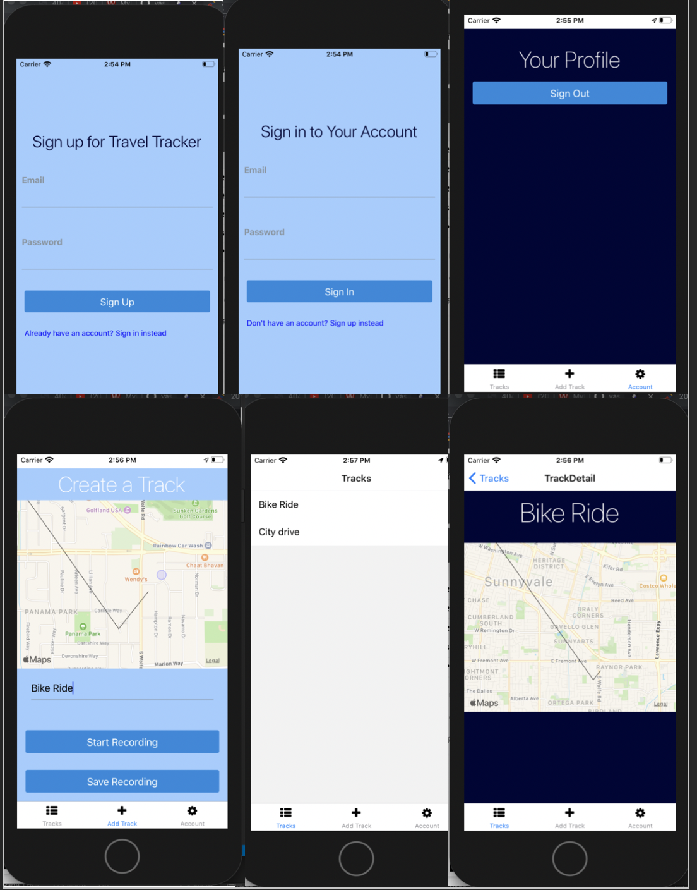

# TravelTracker
A Travel Tracker App built using React Native and JavaScript. It allows you to record, create and save a path of your movement which is displayed on a Map. Created as a part of Stephen Grider's React Native + Hooks Course
- User Authentication and Sign In Screens - Using MongoDB Atlas 

